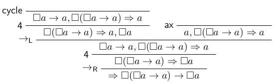

# Sequent Calculus with Zippers

## References

The code in this repository was originally developed as part of the following master thesis:

- Xiaoshuang Yang: *Sequent Calculus with Zippers*.
  University of Amsterdam, 2024.
  <https://eprints.illc.uva.nl/id/eprint/2354>

The original code from the thesis can be found in the `thesis-version` branch.
Ongoing updates and improvements are included in the `main` branch.

## How to

You should have the Haskell build tool `stack` installed, via [ghcup](https://www.haskell.org/ghcup/).
For proof visualization, optonally you may want to install [`graphviz`](https://graphviz.org/).

To build the project run `stack build`.

You can use `stack ghci` to run examples like this:

    stack ghci lib/K.hs lib/MForm.hs

    ghci> formForK 3
    (☐(c → (d → (e → a))) → (☐c → (☐d → (☐e → ☐a))))
    ghci> nFormForK 3
    (☐(c → (d → (e → (b → a)))) → (☐c → (☐d → (☐e → ☐a))))

    ghci> isProvableT K.k (MForm.formForK 3)
    True
    λ> isProvableZ K.k (MForm.formForK 3)
    True
    λ> isProvableT K.k (MForm.nFormForK 3)
    False
    λ> isProvableZ K.k (MForm.nFormForK 3)
    False

In the above `K.k` is the name of the `Logic`, i.e. the proof system.

To run all tests, run `stack test`.

To run all benchmarks, run `stack bench`.
Note that this can take quite long.

## LaTeX output

The prover can generate code for [bussproofs](https://ctan.org/pkg/bussproofs).

    stack ghci lib/GL.hs lib/MForm.hs

    ghci> texFile $ head $ proveZ GL.gl lobaxiom

This will write code into `temp.tex` and then run `pdflatex` on it.
The result looks as follows.

## Benchmarks

You should have LaTeX and [pandoc](https://pandoc.org/) installed.
Then run `make bench/runtime.pdf` and `make bench/memory.pdf`.

Example results are available at
<https://github.com/XiaoshuangYang999/Sequent-Calculus-With-Zippers/releases>.
